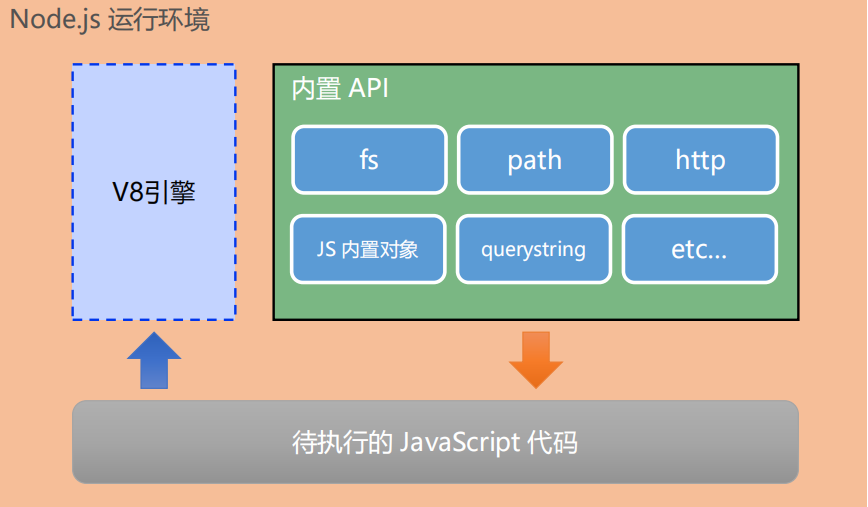

## Nodejs简介
Node.js是基于Chrome V8引擎的JavaScript运行环境
<ul>
<li>
浏览器是JavaScript的前端运行环境
</li>
<li>
Node.js是JavaScript的后端运行环境
</li>
<li>
Node.js中无法调用DOM和BOM等浏览器内置API
</li>
</ul>

Node.js的官网地址为<a>https://nodejs.org/zh-cn/</a>

## Node.js的框架
<ul>
<li>
基于Express框架,可以快速构建框架<a>http://www.expressjs.com.cn/</a>

</li>
<li>
基于Electron框架,可以构建跨平台的桌面应用<a>https://electronjs.org/</a>
</li>
<li>
基于restify框架，可以快速构建API接口项目<a>https://restify.com/</a>
</li>
<li>koa.js,由Express原作者设计，提供更小而精简的核心<a>https://koa.bootcss.com/</a>
</li>
<li>
Nest.js是基于TypeScript的渐进式Node.js框架<a>https://nestjs.com/</a>
</li>
</ul>
## Koa2环境搭建
使用脚手架koa-generator创建koa2项目
